# 🌐 Awesome Technical Support Portal 🚀

### *Curated Ecosystem of SaaS Platforms, Self-Hosted Helpdesks & Open-Source Customer Portals*

  
  
  
  
  

---

  <b>A comprehensive directory of top commercial SaaS support portals and open-source GitHub projects providing customer self-service knowledge bases, ticket submission, and support case tracking.</b>

---

## 📌 Table of Contents

- [📊 Market Overview & Industry Insights](#-market-overview--industry-insights)
- [🏢 SaaS & Hosted Support Portals](#-saas--hosted-support-portals)
- [⭐ Open-Source GitHub Projects](#-open-source-github-projects)
- [🛠️ Architecture & Deployment Considerations](#️-architecture--deployment-considerations)
- [🤝 How to Contribute](#-how-to-contribute)
- [🛡️ Disclaimer & Licensing Notes](#️-disclaimer--licensing-notes)
- [🏷️ Awesome-Technical-Support-Portal](#️-awesome-technical-support-portal)

---

## 📊 Market Overview & Industry Insights

> 📈 **Estimated Market Size**: The global Customer Support & Technical Service Portal software market is valued at **$11.85 Billion in 2026** and is projected to expand to **$24.2 Billion by 2032**, growing at a compound annual growth rate (**CAGR**) of **12.6%**.
>
> 🧩 **Sector Structure & Fragmentation**: The market is **moderately fragmented**. Enterprise CRM giants (*Salesforce*, *ServiceNow*, *Atlassian*) control large-scale corporate deployments, while high-growth platforms (*Zendesk*, *Freshdesk*, *Zoho*) dominate mid-market teams. Meanwhile, an active open-source ecosystem (*Chatwoot*, *osTicket*, *UVdesk*, *Zammad*, *FreeScout*) captures developers, privacy-conscious enterprises, and organizations seeking self-hosted support sovereignty.

---

## 🏢 SaaS & Hosted Support Portals

The following table summarizes top commercial support portals and customer service suites, sorted by **Company Scale (Valuation / Revenue) in descending order**:

| 🏢 Platform / Vendor | 💰 Valuation / Revenue | 🏷️ Starting Pricing | 🎁 Free Tier / Trial Limit | 🎯 Key Capabilities & Target Fit |
| :--- | :--- | :--- | :--- | :--- |
| **[Salesforce Support Portal](https://www.salesforce.com/)** | **$290B+ Market Cap** (~$38B Rev) | `$25` / user / month | **30-day free trial** (Full access, no credit card required) | Experience Cloud self-service portals with knowledge base, AI case routing & community forums. *Best for Salesforce ecosystem.* |
| **[ServiceNow Customer Portal](https://www.servicenow.com/)** | **$180B+ Market Cap** (~$11B Rev) | `$100` / user / month | **Personal Developer Instance (PDI) Free** (Full non-prod sandbox) | Enterprise self-service portal, virtual agents, service catalog & ITIL workflows. *Best for global enterprise IT & CSM.* |
| **[Jira Service Management Portal](https://www.atlassian.com/software/jira/service-management)** | **$45B+ Market Cap** (~$4.5B Rev) | `$22` / agent / month | **Free plan up to 3 agents** (Unlimited portal customers, 2GB storage) | Customer help center, request types, and knowledge base integrated with Jira & Confluence. *Best for dev & IT teams.* |
| **[Zendesk Support Center](https://www.zendesk.com/)** | **$10.2B Valuation** (~$1.7B Rev) | `$19` / agent / month | **14-day free trial** (Full Suite access, no credit card required) | Polished self-service help center, AI answer bots, live chat & community forums. *Best for mid-market & enterprise support.* |
| **[BMC Customer Support](https://www.bmc.com/)** | **$6.8B Private Valuation** (~$2.1B Rev) | `$85` / user / month | **30-day free trial** (Guided enterprise sandbox access) | BMC Helix ITSM self-service portal, case management, and knowledge base. *Best for large enterprise IT service management.* |
| **[Freshdesk Portal](https://freshdesk.com/)** | **$4.5B+ Market Cap** (~$700M Rev) | `$15` / agent / month | **Free plan up to 10 agents** (Includes basic ticketing & customer portal) | Self-service portal, knowledge base, community forums & Freddy AI ticket assistance. *Best for SMBs & scaling support teams.* |
| **[Zoho Desk Portal](https://www.zoho.com/desk/)** | **$1.4B+ Revenue** (Privately Held) | `$14` / agent / month | **Free plan up to 3 agents** (Email ticketing, knowledge base & portal) | Context-aware customer support portal, knowledge base & guided support workflows. *Best for Zoho ecosystem users.* |
| **[Ivanti Self Service](https://www.ivanti.com/)** | **$1.2B+ Revenue** (Privately Held) | `$60` / user / month | **45-day free trial** (Pre-configured evaluation environment) | Neurons for ITSM self-service portal, service catalog & ticket submission. *Best for Ivanti ITSM customers.* |
| **[Deskpro](https://www.deskpro.com/)** | **$50M+ Revenue** (Privately Held) | `$29` / agent / month | **14-day free trial** (Unlimited agents, cloud or self-hosted) | Flexible self-hosted & cloud helpdesk with customer portal, knowledge base & chat. *Best for custom deployment flexibility.* |
| **[SupportPal](https://www.supportpal.com/)** | **$10M+ Revenue** (Privately Held) | `$19.95` / month | **14-day free trial** (Un-encoded self-hosted installation trial) | Commercial self-hosted help desk software with ticket portal, knowledge base & multi-language support. *Best for self-hosted SaaS.* |

---

## ⭐ Open-Source GitHub Projects

Curated list of open-source technical support portals and helpdesk systems, **sorted by GitHub Star Count in descending order**. Each repo includes a direct link to its stargazers page:

### 🏆 Top Open-Source Helpdesk & Customer Portals

1. **[Chatwoot](https://github.com/chatwoot/chatwoot)** 
   - 📜 **License**: MIT | 💻 **Tech Stack**: Ruby on Rails, Vue.js, PostgreSQL, Redis
   - 🌟 **Description**: Modern open-source customer engagement suite with **Help Center portal**, live chat widget, Captain AI assistant, and omnichannel support (email, WhatsApp, Facebook, Telegram).
   - 🎯 **Best For**: Omnichannel customer engagement & self-service knowledge base.

2. **[osTicket](https://github.com/osTicket/osTicket)** 
   - 📜 **License**: GPL-2.0 | 💻 **Tech Stack**: PHP 8.2+, MySQL / MariaDB
   - 🌟 **Description**: The veteran open-source support ticket system featuring a dedicated **customer web portal**, ticket submission forms, status tracking, and knowledge base.
   - 🎯 **Best For**: Traditional IT support ticketing & lightweight customer portals.

3. **[UVdesk Community](https://github.com/uvdesk/community-skeleton)** 
   - 📜 **License**: MIT | 💻 **Tech Stack**: PHP (Symfony Framework), MySQL
   - 🌟 **Description**: Highly customizable enterprise open-source helpdesk with a clean customer support portal, knowledge base, ticket management, and extensive e-commerce plugins.
   - 🎯 **Best For**: E-commerce support portals & customizable Symfony architectures.

4. **[Papercups](https://github.com/papercups-io/papercups)** 
   - 📜 **License**: MIT | 💻 **Tech Stack**: Elixir, Phoenix, React, PostgreSQL
   - 🌟 **Description**: Open-source customer messaging platform with real-time chat widgets, customer support dashboard, and knowledge base integration.
   - 🎯 **Best For**: Developer-first customer support & real-time messaging.

5. **[Zammad](https://github.com/zammad/zammad)** 
   - 📜 **License**: AGPL-3.0 | 💻 **Tech Stack**: Ruby, PostgreSQL / MySQL, Elasticsearch
   - 🌟 **Description**: 100% open-source web-based helpdesk platform with a polished customer-facing portal, multi-channel support (email, chat, phone, social), and fine-grained audit logs.
   - 🎯 **Best For**: Data sovereignty, GDPR compliance, and polished self-hosted portals.

6. **[FreeScout](https://github.com/freescout-help-desk/freescout)** 
   - 📜 **License**: AGPL-3.0 | 💻 **Tech Stack**: PHP (Laravel Framework), MySQL
   - 🌟 **Description**: Ultra-lightweight open-source Zendesk & Help Scout alternative. Features customer portal, knowledge base modules, shared inbox, and 33+ language translations.
   - 🎯 **Best For**: Lightweight shared inbox with customer portal on minimal server hardware.

7. **[Helpy](https://github.com/helpyio/helpy)** 
   - 📜 **License**: MIT | 💻 **Tech Stack**: Ruby on Rails, PostgreSQL
   - 🌟 **Description**: Modern open-source helpdesk with integrated knowledgebase, community discussion forums, ticket handling, and multi-language support.
   - 🎯 **Best For**: Modern community helpdesk & knowledgebase integrations.

8. **[Peppermint](https://github.com/peppermint-lab/peppermint)** 
   - 📜 **License**: MIT | 💻 **Tech Stack**: Next.js, Node.js, Prisma, TailwindCSS
   - 🌟 **Description**: Open-source ticket management and support portal application designed with a sleek modern UI for managing client inquiries.
   - 🎯 **Best For**: Modern React / Next.js stack self-hosted ticketing.

9. **[erxes XOS](https://github.com/erxes/erxes)** 
   - 📜 **License**: AGPL-3.0 | 💻 **Tech Stack**: Node.js, React, MongoDB, GraphQL
   - 🌟 **Description**: Open-source Experience Operating System (XOS) offering an integrated customer portal, team inbox, knowledge base, and CRM modules.
   - 🎯 **Best For**: Unified CRM + customer support platform.

10. **[OTRS Open Source](https://github.com/OTRS/otrs)** 
    - 📜 **License**: GPL-3.0 | 💻 **Tech Stack**: Perl, MySQL / PostgreSQL
    - 🌟 **Description**: Battle-tested IT service management system with customer self-service portal, service catalog, and ITIL-aligned processes.
    - 🎯 **Best For**: Enterprise IT service management & ticket workflows.

---

## 🛠️ Architecture & Deployment Considerations

When evaluating technical support portals for enterprise or self-hosted deployment:

- **🔒 Data Sovereignty & Compliance**: Self-hosted portals like *Zammad*, *FreeScout*, and *osTicket* guarantee complete control over customer PII, adhering strictly to GDPR, CCPA, and HIPAA compliance regulations.
- **⚡ Resource Requirements**: 
  - *FreeScout* & *osTicket* run efficiently on standard PHP/MySQL environments (even shared hosting).
  - *Chatwoot* & *Zammad* require dedicated containerized infrastructure (Docker / Kubernetes, PostgreSQL, Redis, Elasticsearch, 4GB+ RAM).
- **🤖 AI Integration**: Commercial platforms (*Salesforce*, *Zendesk*) and modern open-source solutions (*Chatwoot Captain AI*) offer automated article suggestions, ticket classification, and automated agent resolution.

---

## 🤝 How to Contribute

Contributions are warmly welcome! To add or update a technical support portal:

1. **Fork** this repository.
2. Edit `README.md` keeping formatting consistent.
3. For open-source repos, include star counts, license info, and direct link to stargazers.
4. Submit a **Pull Request** with a brief summary of additions.

---

## 🛡️ Disclaimer & Licensing Notes

- This list is **community-curated** for educational and decision-making purposes — inclusion does not imply official endorsement.
- Verify software licensing before production deployment: *Chatwoot* (MIT), *osTicket* (GPL-2.0), *UVdesk* (MIT), *Zammad* (AGPL-3.0), *FreeScout* (AGPL-3.0).

---

## 🏷️ Awesome-Technical-Support-Portal

Thank you for exploring **Awesome-Technical-Support-Portal**! If you find this curated ecosystem list helpful, please consider **starring ⭐️ the repository** and sharing it with your engineering and support operations teams.

---

  <b>Made for support leaders, service operations managers, and organizations seeking technical support portal sovereignty.</b> 
  <i>Let's make technical support portals more open, transparent, and customer-centric.</i>

